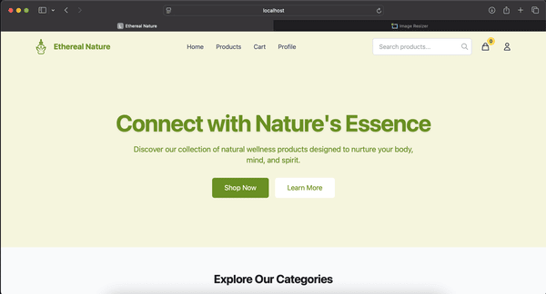

# Ethereal Nature

<div align="center">
  
</div>


## 🌿 About

Ethereal Nature is an eshop application for essential oils built with React, React Native, and Firebase.

## 🚀 Features

- **Cross-platform development** - Shared code between web and mobile
- **Responsive web application** - Built with React, Vite, and Tailwind CSS
- **Native mobile app** - Built with React Native, Expo, and NativeWind
- **Authentication** - User registration and login functionality
- **Product browsing** - View products by category, search, and filter
- **Shopping cart** - Add, remove, and update quantities
- **Checkout process** - Multi-step checkout with shipping and payment
- **User profiles** - View order history and manage account

## 🛠️ Technologies

### Web (React)
- React + Vite
- React Router DOM
- Tailwind CSS
- Zustand for state management

### Mobile (React Native)
- Expo
- React Navigation
- NativeWind
- Zustand for state management

### Shared
- TypeScript
- Firebase (Auth, Firestore Storage)

## 📁 Project Structure

```
ethereal_nature/
├── packages/
│   ├── mobile/         # Expo/React Native app
│   ├── web/            # Vite + React web app
│   └── shared/         # Shared code (models, utilities, config)
├── firebase/           # Firebase configuration
├── package.json        # Root workspace configuration
└── README.md           # Project documentation
```


### Prerequisites

- Node.js 16+
- Firebase project

### Installation

1. Clone the repository
   ```
   git clone https://github.com/yourusername/ethereal-nature.git
   cd ethereal-nature
   ```

2. Install dependencies
   ```
   npm install
   ```

3. Create a Firebase project and update the configuration in `firebase/index.ts`

### Running the applications

#### Web App
```
npm run dev:web
```

#### Mobile App (with Expo)
```
npm  run dev:mobile
```

